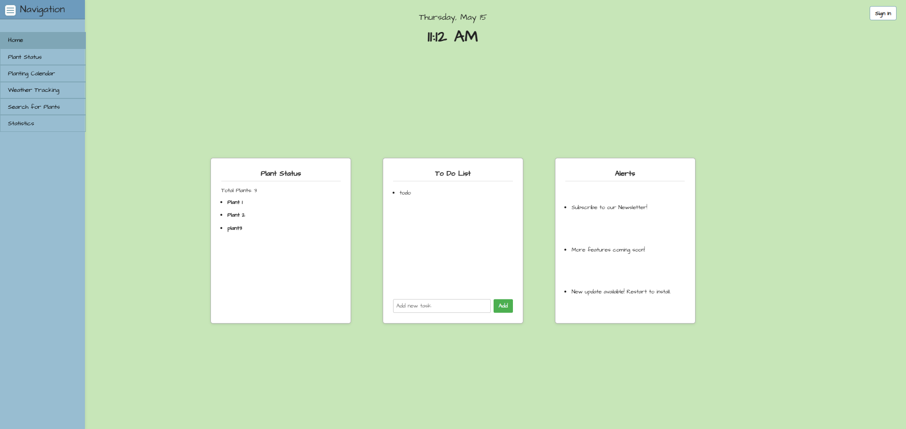

# Garden Monitor

Garden Monitor is a tool designed to help gardeners of all experience levels care for and cultivate plants.

## Run the Project

### Backend

Prerequisites:

- [Python](https://www.python.org/)
- [Git](https://git-scm.com/)
- [Trefle API Key](https://trefle.io/)

```bash
# Create and activate a virtual environment, then install the required dependencies:
python -m venv venv && venv\Scripts\activate && python.exe -m pip install --upgrade pip && pip install requests flask-cors

# Start the Flask backend server:
venv\Scripts\activate && python backend\app.py

# (Optional) Fetch plant data:
venv\Scripts\activate && python fetch_plant_data.py

# MacOS/Linux:
# Create and activate a virtual environment, then install dependencies:
python3 -m venv venv && source venv/bin/activate && python3 -m pip install --upgrade pip && pip install requests flask-cors

# Start the Flask backend server:
source venv/bin/activate && python backend/app.py

# (Optional) Fetch plant data:
source venv/bin/activate && python fetch_plant_data.py
```

### Web App

Prerequisites:

- [Node.js v22.15.0 (LTS)](https://nodejs.org)

```bash
# Install npm
brew install node

# Install the required dependencies for the frontend to the client directory:
npm --prefix client install react react-dom react-router-dom react-scripts webpack@latest webpack-cli@latest

# Install Google OAuth dependencies to the client directory:
npm --prefix client install @react-oauth/google --legacy-peer-deps

# Start the React frontend app:
npm --prefix client start
```

## Screenshots

[](media/home_page.png)
